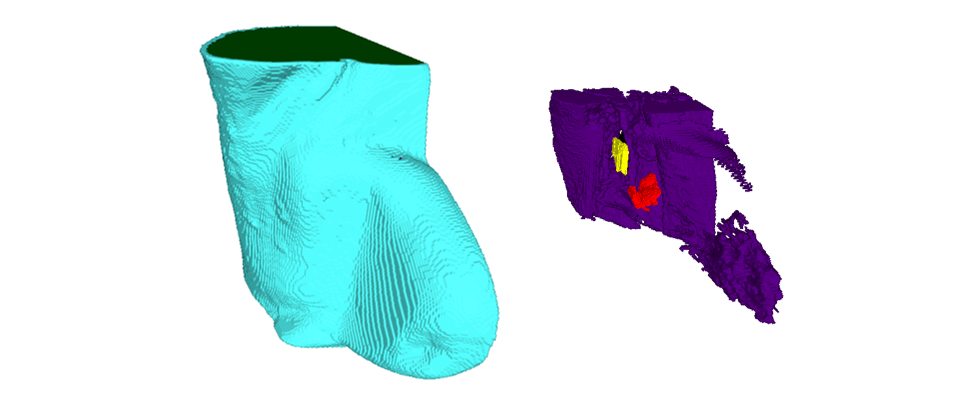

# Model AR_004

## 1.	Patient Details

* **Body Mass Index:** 26
* **Age:** 79
* **Approximate Skin Thickness:** 3 mm

## 2.	Axillary Regions Models
### 2.1	Right:

* **Available Files:**
    1.	AR_004_R_skin (.mat/.raw/.stl)
    2.	AR_004_R_skin_filled (.stl)
    3.	AR_004_R_adipose (.mat/.raw/.stl)
    4.	AR_004_R_adipose_filled (.stl)
    5.	AR_004_R_lung (.mat/.raw/.stl)
    6.	AR_004_R_muscle (.mat/.raw/.stl)
    7.	AR_004_R_h_aln (.mat/.raw/.stl)
    8.	AR_004_R_m_aln (.mat/.raw/.stl)

    9.	AR_004_R_label_map (.mat/.raw)
    10.	AR_004_R_weight_map (.mat/.raw)
    
* **Grid Size:** 213 x 360 x 144 (Axial x Coronal x Sagittal)
* **Voxel Size:** 0.9965 x 0.9965 x 1 (Axial x Coronal x Sagittal)
* **Number of Healthy Lymph Nodes:** 1
* **Number of Metastasised Lymph Nodes:** 2

* **More information at:** AR_004_Model_Details.pdf

### 2.2	Left:

* **Available Files:**
    1.	AR_004_L_skin (.mat/.raw/.stl)
    2.	AR_004_L_skin_filled (.stl)
    3.	AR_004_L_adipose (.mat/.raw/.stl)
    4.	AR_004_L_adipose_filled (.stl)
    5.	AR_004_L_lung (.mat/.raw/.stl)
    6.	AR_004_L_muscle (.mat/.raw/.stl)
    7.	AR_004_L_h_aln (.mat/.raw/.stl)

    8.	AR_004_L_label_map (.mat/.raw)
    9.	AR_004_L_weight_map (.mat/.raw)

* **Grid Size:** 213 x 360 x 154 (Axial x Coronal x Sagittal)
* **Voxel Size:** 0.9965 x 0.9965 x 1 (Axial x Coronal x Sagittal)
* **Number of Healthy Lymph Nodes:** 3
* **Number of Metastasised Lymph Nodes:** 0

* **More information at:** AR_004_Model_Details.pdf

## 3.	Dielectric Properties

Read "Assigning_Dielectric_Properties_to_MRI-based_Models" file located in the root folder.

## Cite Us

If you use some of these models, please cite us with:

D. M. Godinho, J. M. Felício, T. Castela, N. A. Silva, M. L. Orvalho, C. A. Fernandes, R. C. Conceição, "MRI-based Axillary Numerical Models and Extraction of Axillary Lymph Nodes Dielectric Properties for Microwave Imaging" (under review in Medical Physics, 2021).