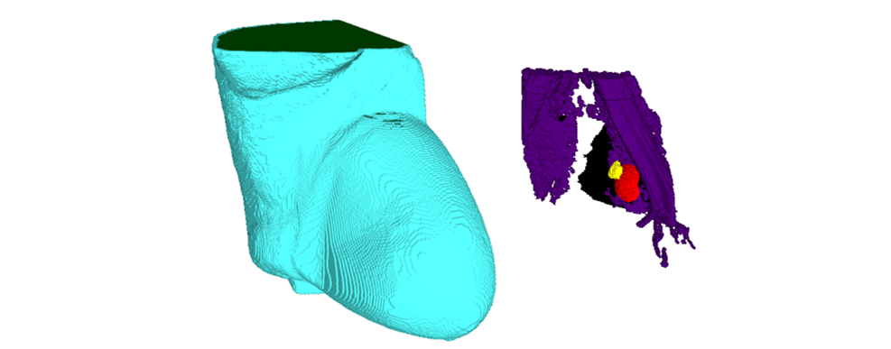
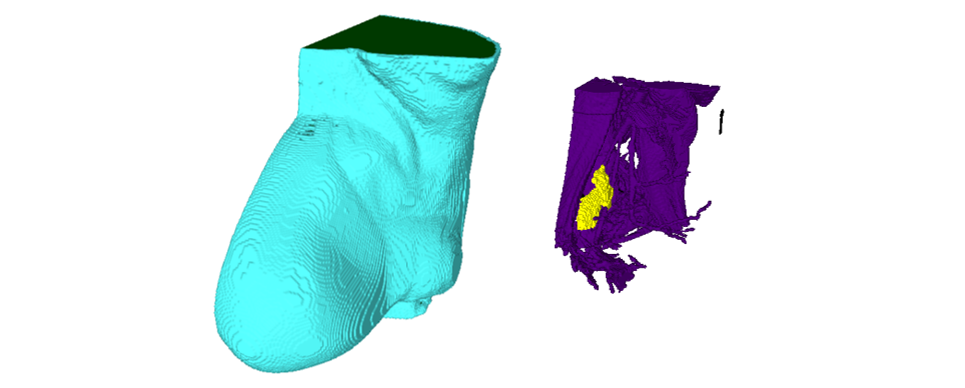

# Model AR_005

## 1.	Patient Details

* **Body Mass Index:** 31
* **Age:** 67
* **Approximate Skin Thickness:** 3 mm

## 2.	Axillary Regions Models
### 2.1	Right:

* **Available Files:**
    1.	AR_005_R_skin (.mat/.raw/.stl)
    2.	AR_005_R_skin_filled (.stl)
    3.	AR_005_R_adipose (.mat/.raw/.stl)
    4.	AR_005_R_adipose_filled (.stl)
    5.	AR_005_R_lung (.mat/.raw/.stl)
    6.	AR_005_R_muscle (.mat/.raw/.stl)
    7.	AR_005_R_h_aln (.mat/.raw/.stl)
    8.	AR_005_R_m_aln (.mat/.raw/.stl)

    9.	AR_005_R_label_map (.mat/.raw)
    10.	AR_005_R_weight_map (.mat/.raw)

* **Grid Size:** 217 x 443 x 169 (Axial x Coronal x Sagittal)
* **Voxel Size:** 0.9965 x 0.9965 x 1 (Axial x Coronal x Sagittal)
* **Number of Healthy Lymph Nodes:** 1
* **Number of Metastasised Lymph Nodes:** 1

* **More information at:** AR_005_Model_Details.pdf

### 2.2	Left:

* **Available Files:**
    1.	AR_005_L_skin (.mat/.raw/.stl)
    2.	AR_005_L_skin_filled (.stl)
    3.	AR_005_L_adipose (.mat/.raw/.stl)
    4.	AR_005_L_adipose_filled (.stl)
    5.	AR_005_L_lung (.mat/.raw/.stl)
    6.	AR_005_L_muscle (.mat/.raw/.stl)
    7.	AR_005_L_h_aln (.mat/.raw/.stl)

    8.	AR_005_L_label_map (.mat/.raw)
    9.	AR_005_L_weight_map (.mat/.raw)

* **Grid Size:** 217 x 443 x 138 (Axial x Coronal x Sagittal)
* **Voxel Size:** 0.9965 x 0.9965 x 1 (Axial x Coronal x Sagittal)
* **Number of Healthy Lymph Nodes:** 2
* **Number of Metastasised Lymph Nodes:** 0

* **More information at:** AR_005_Model_Details.pdf

## 3.	Dielectric Properties

Read "Assigning_Dielectric_Properties_to_MRI-based_Models" file located in the root folder.

## Cite Us

If you use some of these models, please cite us with:

Godinho, DM, Felício, JM, Castela, T, et al. Development of MRI-based axillary numerical models and estimation of axillary lymph node dielectric properties for microwave imaging. Med Phys. 2021; 48:5974–5990. [https://doi.org/10.1002/mp.15143](https://doi.org/10.1002/mp.15143)